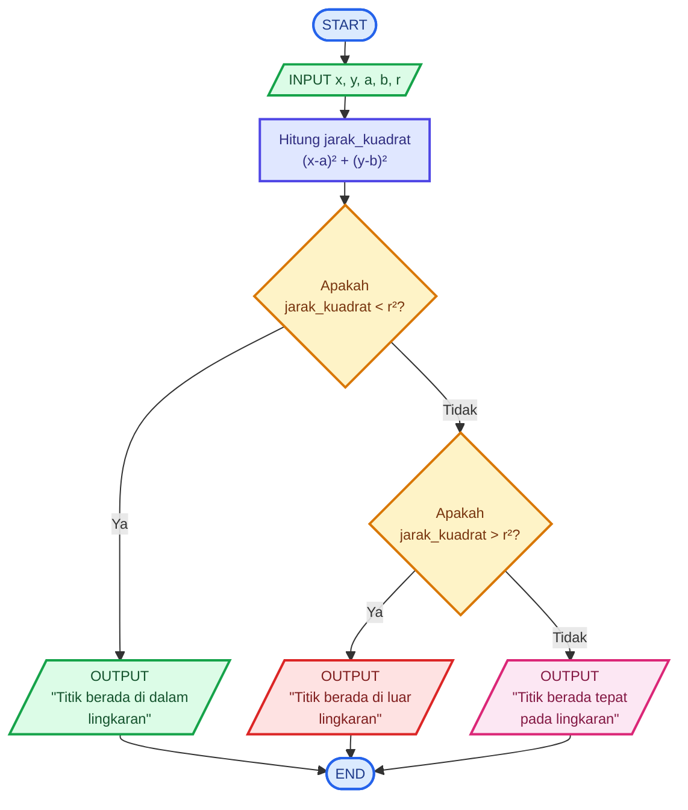

# 🧮 Menentukan Apakah Titik Berada di Dalam atau di Luar Lingkaran

## 📝 Deskripsi Masalah

Dalam materi geometri di tingkat SMA, salah satu hal yang dipelajari adalah menentukan posisi sebuah titik terhadap lingkaran. Sebuah titik dapat berada **di dalam, tepat pada, atau di luar lingkaran**. Posisi tersebut dapat diketahui dengan melihat jarak titik terhadap pusat lingkaran dan membandingkannya dengan jari-jari lingkaran.

Pada masalah ini, program digunakan untuk menentukan posisi sebuah titik terhadap lingkaran berdasarkan koordinat yang diberikan. Program akan menerima koordinat titik `P(x,y)`, koordinat pusat lingkaran `(a,b)`, serta jari-jari lingkaran `r`.

Untuk menentukan posisinya, program menghitung jarak kuadrat antara titik dan pusat lingkaran dengan rumus:

$$
(x-a)^2+(y-b)^2
$$

Hasil perhitungan tersebut kemudian dibandingkan dengan `r²`.

- Jika hasil perhitungan **lebih kecil dari `r²`**, maka titik berada **di dalam lingkaran**.
- Jika hasil perhitungan **lebih besar dari `r²`**, maka titik berada **di luar lingkaran**.
- Jika hasil perhitungan **sama dengan `r²`**, maka titik berada **tepat pada lingkaran**.

Dengan menggunakan kondisi tersebut, program dapat menentukan posisi titik terhadap lingkaran berdasarkan koordinat yang dimasukkan.

---

## 📥 Input - Proses - Output

### Input

Program menerima beberapa data sebagai input, yaitu:

- Koordinat `x` dari titik.
- Koordinat `y` dari titik.
- Koordinat `a` dari pusat lingkaran.
- Koordinat `b` dari pusat lingkaran.
- Jari-jari lingkaran `r`.

### Proses

Program menghitung jarak kuadrat antara titik dan pusat lingkaran menggunakan rumus:

$$
d^2=(x-a)^2+(y-b)^2
$$

Kemudian hasil tersebut dibandingkan dengan kuadrat jari-jari:

$$
r^2
$$

Kondisi yang digunakan adalah:

1. Jika `d² < r²`, maka titik berada di **dalam lingkaran**.
2. Jika `d² > r²`, maka titik berada di **luar lingkaran**.
3. Jika `d² = r²`, maka titik berada **tepat pada lingkaran**.

### Output

Program menampilkan posisi titik terhadap lingkaran, yaitu:

- `Titik berada di dalam lingkaran`
- `Titik berada di luar lingkaran`
- `Titik berada tepat pada lingkaran`

---

## 💻 Pseudocode

```text
START

INPUT x
INPUT y
INPUT a
INPUT b
INPUT r

jarak_kuadrat = (x - a)^2 + (y - b)^2
radius_kuadrat = r^2

IF jarak_kuadrat < radius_kuadrat THEN
    OUTPUT "Titik berada di dalam lingkaran"

ELSE IF jarak_kuadrat > radius_kuadrat THEN
    OUTPUT "Titik berada di luar lingkaran"

ELSE
    OUTPUT "Titik berada tepat pada lingkaran"

END IF

END
```

---

## 📊 Flowchart



---

## 🧪 Test Case

Program diuji menggunakan dua kasus untuk memastikan kondisi yang dibuat dapat berjalan dengan baik.

| Test Case | Titik `P(x,y)` | Pusat `C(a,b)` | Jari-jari `r` | Perhitungan | Kondisi | Hasil yang Diharapkan |
|---|---|---|---:|---|---|---|
| 1 | `P(2,2)` | `C(0,0)` | 5 | `(2-0)² + (2-0)² = 8` | `8 < 25` | Titik berada di dalam lingkaran |
| 2 | `P(6,3)` | `C(0,0)` | 5 | `(6-0)² + (3-0)² = 45` | `45 > 25` | Titik berada di luar lingkaran |

### 🔎 Penjelasan Test Case 1

Diketahui:

- Titik `P(2,2)`
- Pusat lingkaran `C(0,0)`
- Jari-jari `r = 5`

Perhitungannya:

$$
(2-0)^2+(2-0)^2
$$

$$
=4+4
$$

$$
=8
$$

Sedangkan:

$$
r^2=5^2=25
$$

Karena:

$$
8 < 25
$$

maka titik `P(2,2)` berada **di dalam lingkaran**.

### 🔎 Penjelasan Test Case 2

Diketahui:

- Titik `P(6,3)`
- Pusat lingkaran `C(0,0)`
- Jari-jari `r = 5`

Perhitungannya:

$$
(6-0)^2+(3-0)^2
$$

$$
=36+9
$$

$$
=45
$$

Sedangkan:

$$
r^2=5^2=25
$$

Karena:

$$
45 > 25
$$

maka titik `P(6,3)` berada **di luar lingkaran**.

---

## 🐍 Implementasi Python

Implementasi program dibuat menggunakan bahasa pemrograman **Python**. Program dapat dijalankan melalui **Visual Studio Code**.

Source code disimpan dalam file:

```text
main.py
```

Berikut kode programnya:

```python
x = float(input("Masukkan x titik: "))
y = float(input("Masukkan y titik: "))
a = float(input("Masukkan x pusat lingkaran: "))
b = float(input("Masukkan y pusat lingkaran: "))
r = float(input("Masukkan jari-jari lingkaran: "))

jarak_kuadrat = (x - a) ** 2 + (y - b) ** 2
radius_kuadrat = r ** 2

if jarak_kuadrat < radius_kuadrat:
    print("Titik berada di dalam lingkaran")
elif jarak_kuadrat > radius_kuadrat:
    print("Titik berada di luar lingkaran")
else:
    print("Titik berada tepat pada lingkaran")
```

---

## 📸 Hasil Pengujian


## ✅ Kesimpulan

Berdasarkan hasil pengujian, program dapat menentukan posisi sebuah titik terhadap lingkaran dengan menggunakan koordinat titik, koordinat pusat lingkaran, dan jari-jari lingkaran.

Pada **Test Case 1**, titik `P(2,2)` berada di dalam l
